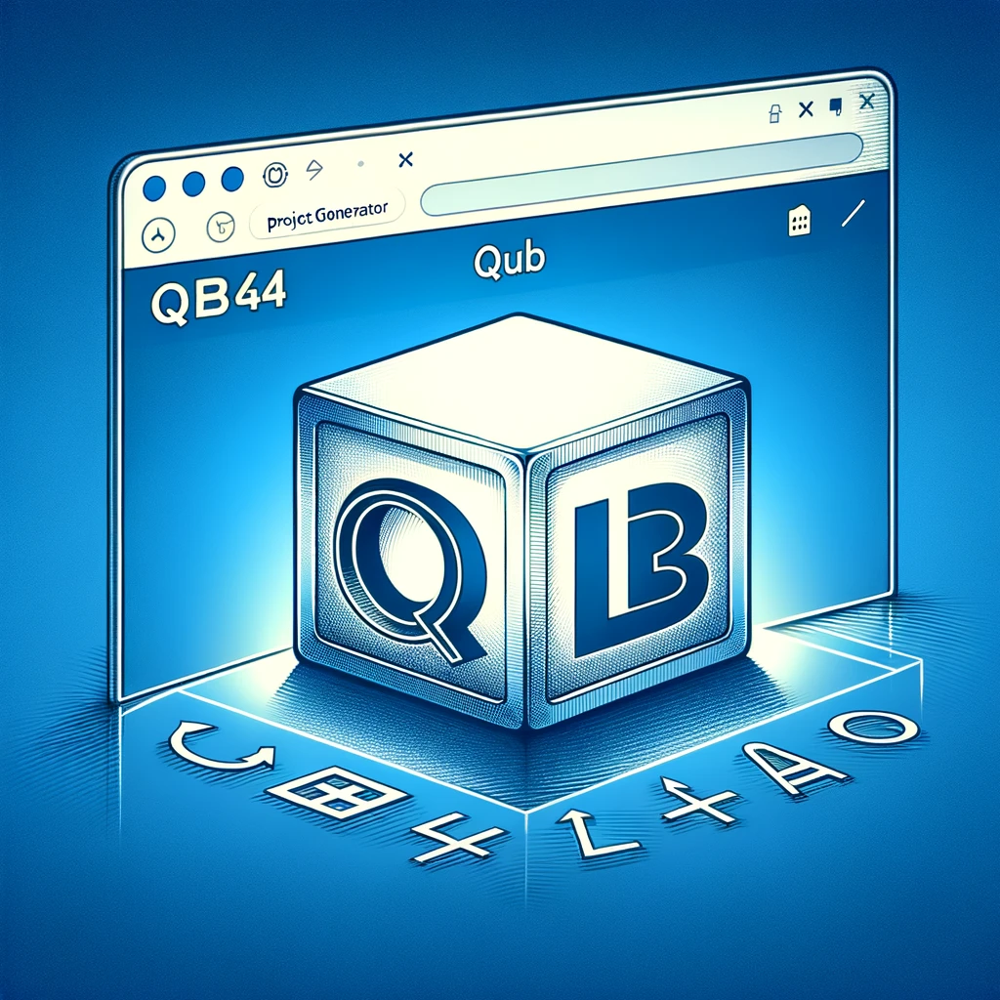
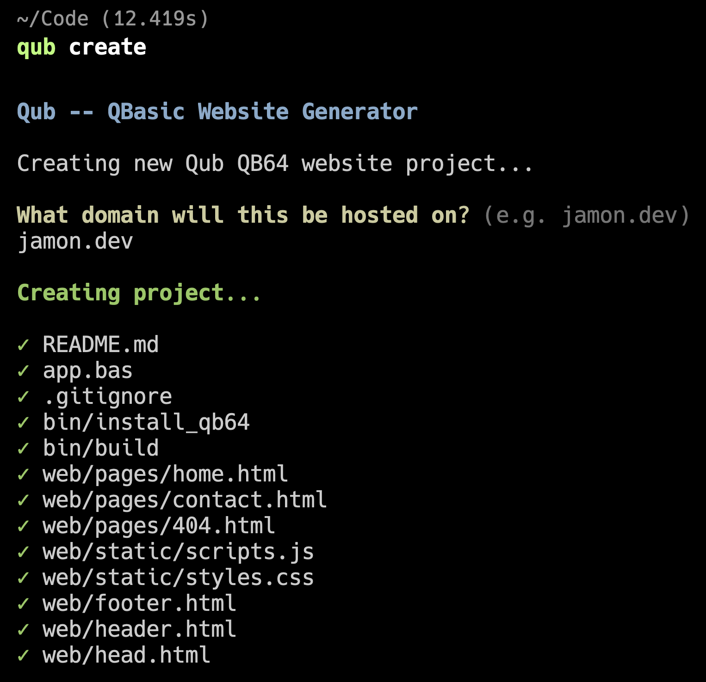

# Qub -- QBasic Website Generator



Qub (pronounced "cube") is a CLI that generates a web server and framework for building websites in [QB64](https://qb64.com/) -- a more modern variant of QBasic.

<table><tr><td>
  
</td><td>
  
</td></tr></table>

## Getting Started

_Windows Support_: Qub has only been tested on macOS and Linux. It might work on Windows WSL (Windows Subsystem for Linux) or Git Bash on Windows. If you want to help test and make it run on Windows, please open an issue or PR!

To get started, set up your `qub` alias first:

```
alias qub="source <(curl -sSL https://raw.githubusercontent.com/jamonholmgren/qub/main/src/cli.sh)"
```

Now, you should be able to run it like so:

```
qub
qub --version
qub --help
qub create
```

## History

When I was twelve, I built my first game in QBasic -- and kept building games and small apps (we called them "programs" in those days) for years. I have a lot of nostalgia and a special place in my heart for QBasic.

A few years ago, I was talking about rebuilding my website in something different, just for a fun challenge, and my friend Mark Villacampa said ["do it in BASIC you coward!"](https://twitter.com/MarkVillacampa/status/1594426506754801664). I took on the challenge and built [jamon.dev](https://jamon.dev) in QB64.

Once I had a working website, I realized that I wanted to make it easier for other people to build websites in QB64, so I started building Qub, aided by @knewter who is another QBasic fan from way back.

## TODO

- [ ] Fill out the README, documentation, screenshots
- [ ] Set up CI
- [ ] Add a Deployment doc
- [ ] Make the default template look nicer, better template README
- [ ] htmx version maybe
- [ ] YouTube video on Jamon's Code Quests

## License

MIT -- see [LICENSE](LICENSE) for details.

QB64 is licensed under the [MIT](https://github.com/QB64Official/qb64/blob/master/licenses/COPYING.TXT) license.
